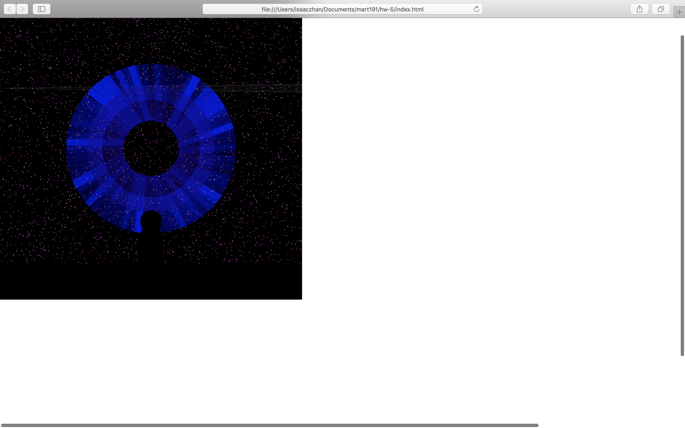

# hw-5

this coding session kicked my butt as usual, I tend to have great ideas for what i want to accomplish but lack the skill set to pull it off so the tasks i am trying to do are out of reach i need to crawl before i walk and hopfully it will make life easyer. i fallow along with youtub videos and listen to the lectures again because i record them, and do the code examples in the p5.js files, but this is difficult to wrap my head around.

## Site url
https://irzahn.github.io/191-work/hw-5
